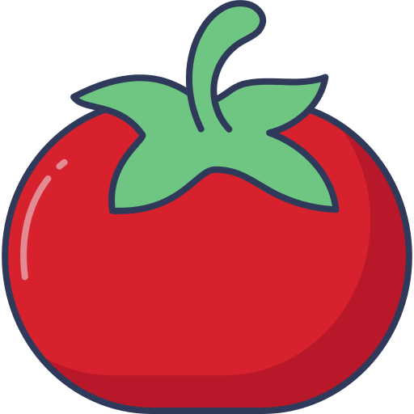

# گوجه

گوجه یک نرم افزار دسکتاپ طراحی شده مخصوص میادین میوه و تره بار و میوه فروشی ها است

## نسخه انگلیسی

[Read english version](README.md)

## نصب

برای نصب آخرین نسخه موجود برای سیستم عامل خود را از [اینجا](https://github.com/imkarimkarim/goje/releases) دانلود کرده و نصب کنید
 
<i> فعلا فقط برای ویندوز و نسخه های مشهور لینوکس امکان نصب وجود دارد...</i>

## اسکرین شات ها

اگر تمایل دارید قبل از نصب اسکریت شات های برنامه را از [اینجا](docs/DOCS.md) تماشا کنید
